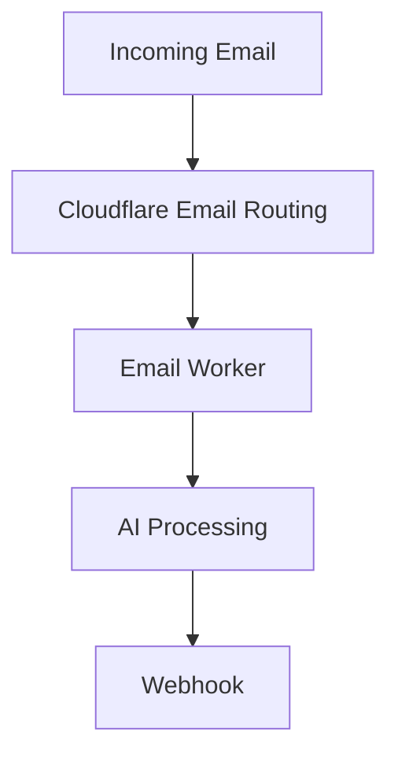

# Mailhook Worker

A Cloudflare Email Worker that processes incoming emails, cleans and translates them using AI, and forwards them to a webhook endpoint.

## Overview

This project leverages Cloudflare's Email Routing and Workers platform to create an intelligent email processing pipeline. When emails are received, the worker:

1. Parses the raw email content using PostalMime
2. Extracts and cleans the email body (removes URLs, formatting, etc.)
3. Rewrites/translates the content using AI (Claude 3.5 Haiku via OpenRouter)
4. Forwards the processed email data to a webhook URL

## Features

- **Email Parsing**: Uses PostalMime to parse raw email messages
- **Content Cleaning**: Removes URLs, extra whitespace, and formatting
- **AI Processing**: Automatically translates non-English emails and cleans up content
- **Webhook Integration**: Forwards processed emails to any webhook endpoint
- **Error Handling**: Robust error handling with email rejection on failures

## How Cloudflare Email Workers Work

Cloudflare Email Workers allow you to process incoming emails programmatically. Here's how they work:

### Email Routing Setup

1. **Domain Configuration**: Configure your domain to use Cloudflare's MX records
2. **Worker Binding**: Bind your worker to handle incoming emails
3. **Message Processing**: The worker receives a `ForwardableEmailMessage` object with email data

### Email Worker Handler

```javascript
export default {
  async email(message, env, ctx) {
    // Process the incoming email
    // message.raw contains the raw email data
    // message.from and message.to contain sender/recipient info
  },
};
```

### Email Actions

- **Forward**: `message.forward(email)` - Forward to another email address
- **Reply**: `message.reply(emailMessage)` - Send a reply to the sender
- **Reject**: `message.setReject(reason)` - Reject the email with a reason

## Architecture



## Setup

### Prerequisites

- Cloudflare account with Email Routing enabled
- Domain configured with Cloudflare DNS
- OpenRouter API key for AI processing
- Webhook endpoint to receive processed emails

### Environment Variables

Configure these environment variables in your Cloudflare Worker:

- `OPENROUTER_API_KEY`: Your OpenRouter API key for AI processing
- `WEBHOOK_URL`: The endpoint where processed emails will be sent

### Deployment

1. Clone this repository
2. Install dependencies:

   ```bash
   npm install
   ```

3. Configure your `wrangler.jsonc`:

   ```json
   {
     "name": "mailhook-worker",
     "main": "src/index.ts",
     "compatibility_date": "2024-01-01"
   }
   ```

4. Add your secrets:

   ```bash
   npx wrangler secret put OPENROUTER_API_KEY
   npx wrangler secret put WEBHOOK_URL
   ```

5. Deploy the worker:

   ```bash
   npx wrangler deploy
   ```

### Email Routing Configuration

1. In the Cloudflare dashboard, navigate to Email Routing
2. Add your domain and configure MX records
3. Create a destination address or custom route
4. Set up an Email Worker route to trigger this worker

## Dependencies

- `postal-mime`: Email parsing library
- `html-to-text`: Convert HTML email content to plain text

## Email Processing Pipeline

### 1. Email Parsing

The worker uses PostalMime to parse the raw email into a structured format:

```javascript
const email = await PostalMime.parse(message.raw);
```

### 2. Content Extraction

Extracts the email body, preferring plain text over HTML:

```javascript
let body = email.text;
if (!body && email.html) {
  body = convert(email.html, {
    selectors: [
      {selector: "a", options: {ignoreHref: true}},
      {selector: "img", format: "skip"},
    ],
  });
}
```

### 3. Content Cleaning

Removes URLs, extra whitespace, and formatting:

- Strips HTTP/HTTPS links
- Removes empty brackets
- Normalizes whitespace

### 4. AI Processing

Sends the cleaned content to Claude 3.5 Haiku for:

- Translation to English (if needed)
- Content cleanup and formatting
- Removal of marketing content, footers, etc.

### 5. Webhook Delivery

Forwards the processed email data as JSON:

```javascript
{
  "subject": "Email subject",
  "name": "Sender name",
  "email": "sender@example.com",
  "message": "Processed email content",
  "source": "email",
  "reply_to": "reply@example.com",
  "message_id": "unique-message-id",
  "sent_at": "2024-01-01T12:00:00Z"
}
```

## Error Handling

The worker includes comprehensive error handling:

- Email parsing failures result in rejection
- AI processing errors cause rejection
- Webhook delivery failures cause rejection
- All errors are logged for debugging

## Local Development

1. Start the development server:

   ```bash
   npx wrangler dev --remote
   ```

2. Test with a sample email:

   ```bash
   curl -X POST 'http://localhost:8787/cdn-cgi/handler/email' \
     --url-query 'from=sender@example.com' \
     --url-query 'to=recipient@example.com' \
     --header 'Content-Type: application/json' \
     --data-raw 'Subject: Test Email

   This is a test email body.'
   ```

## Monitoring

Monitor your worker's performance and email processing in the Cloudflare dashboard:

- View worker logs and errors
- Monitor email routing analytics
- Track webhook delivery success rates

## Contributing

1. Fork the repository
2. Create a feature branch
3. Make your changes
4. Test thoroughly
5. Submit a pull request

## License

This project is licensed under the MIT License.
